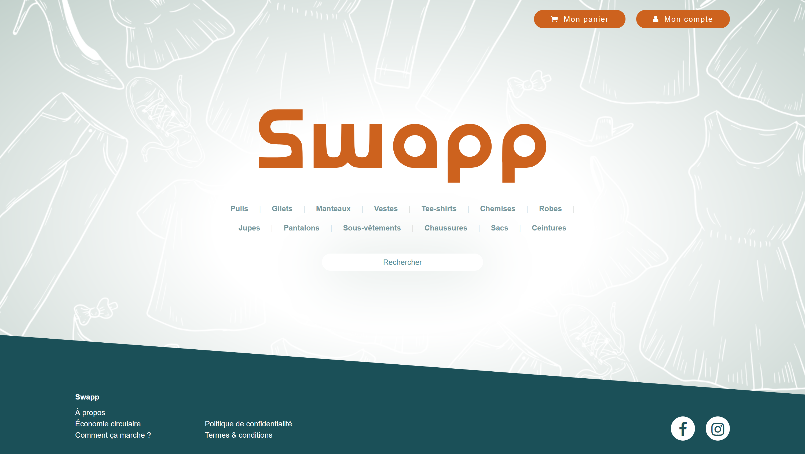
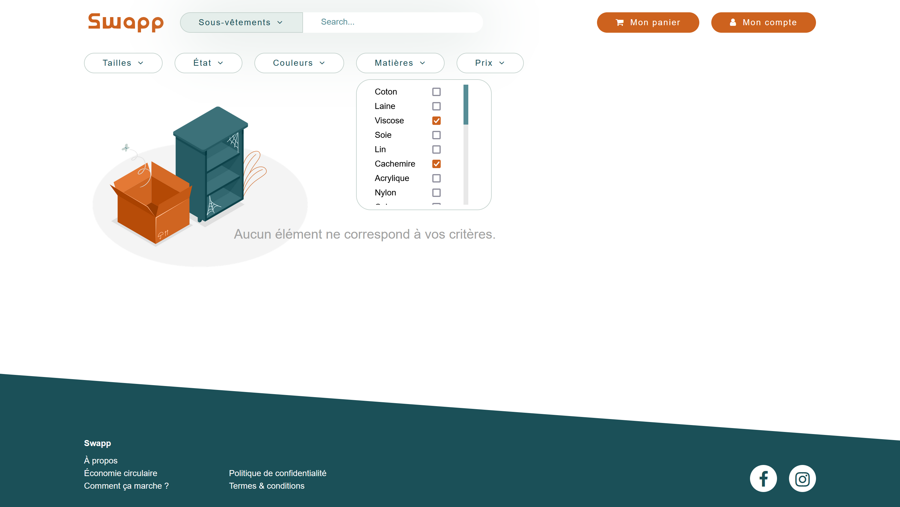
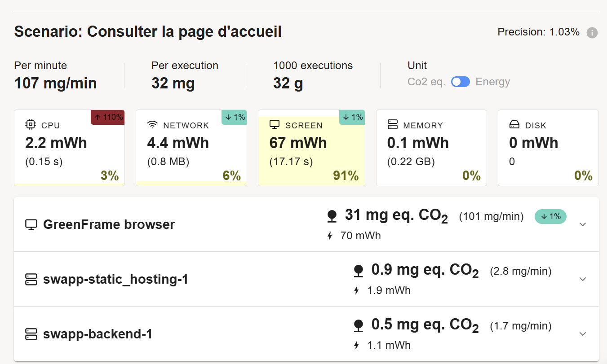
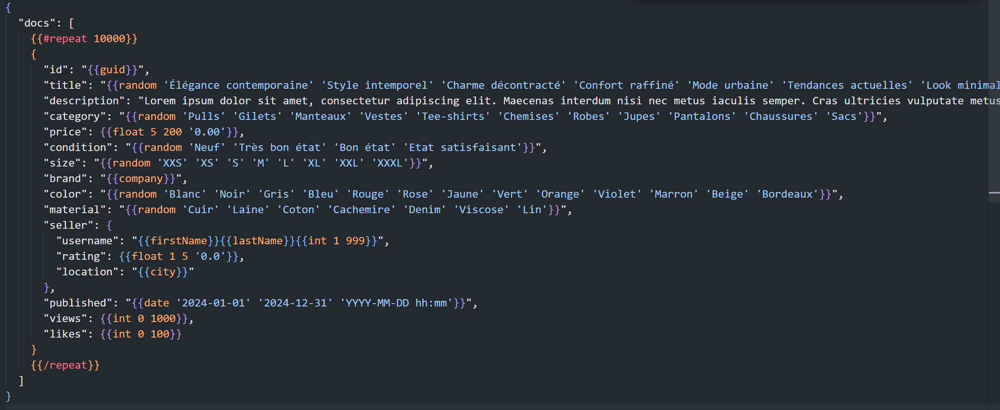
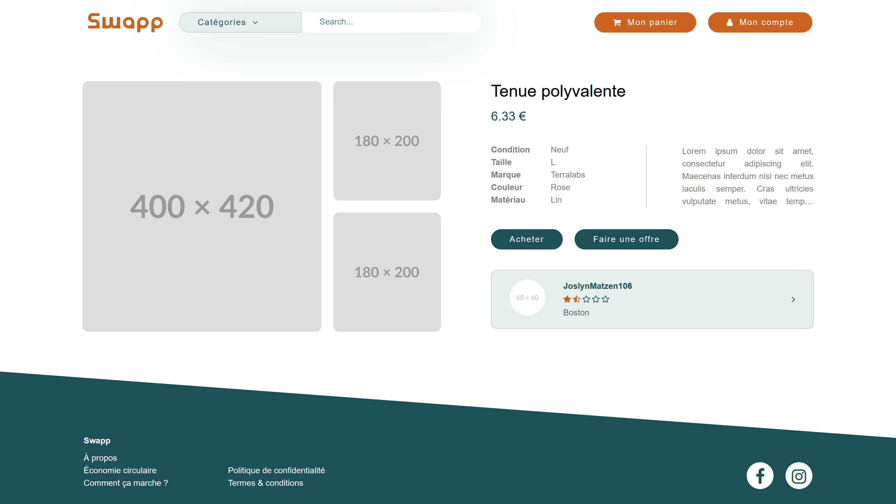
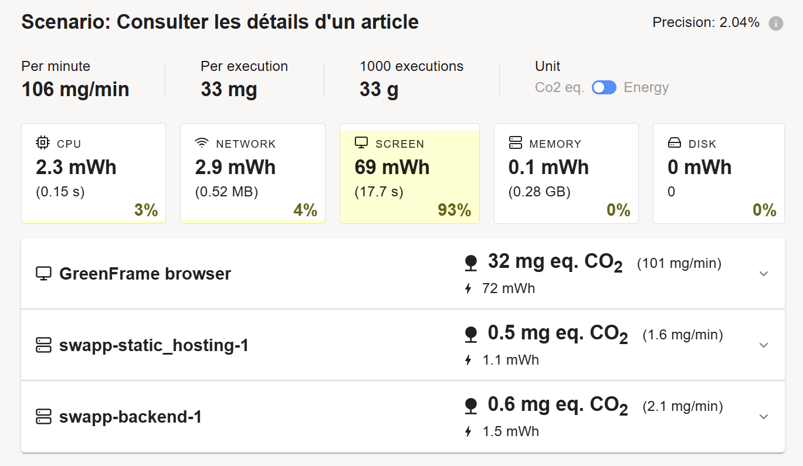

# Swapp
Plateforme de vente et d'achat de vêtements d'occasion entre particuliers.

## Choix du sujet
Dans notre quotidien, les plateformes d’achat et de revente d’articles de seconde main, comme Vinted, prennent une place importante. En tant qu'utilisatrices régulières de ces services pour acheter et revendre des vêtements et accessoires que nous n'utilisons plus, nous avons constaté qu’elles pouvaient avoir un impact environnemental conséquent malgré leur objectif de promouvoir la réutilisation. Cela est dû à la forte demande en infrastructure numérique et au nombre d'interactions qu'elles nécessitent. 

L'essor des plateformes de seconde main s'inscrit dans une dynamique plus large d'économie circulaire. 73 % des Français ont déclaré avoir acheté un produit d'occasion au cours des 12 derniers mois (source : [ENOV](https://enov.fr/blog/actus/marche-de-la-seconde-main-2023)). Ces services jouent un rôle crucial dans la lutte contre la surconsommation et la réduction des déchets, mais leur impact écologique lié à leur utilisation numérique mérite d’être examiné pour optimiser leurs bénéfices.

## Utilité sociale
Les services de vente et d'échange d'articles de seconde main jouent un rôle social essentiel en réduisant les déchets et en prolongeant la durée de vie des objets. En facilitant les échanges entre particuliers, ces plateformes luttent activement contre la culture du jetable et la surproduction, notamment dans des secteurs à fort impact environnemental comme la mode, où la fast fashion est régulièrement pointée du doigt. 

Elles offrent une alternative à la consommation de produits neufs, plus durable et accessible, tout en permettant aux utilisateurs de générer un revenu complémentaire en revendant des articles qu'ils n'utilisent plus. Ces services sont également un levier d’inclusion économique, permettant à un large public d'acquérir des biens de qualité à prix réduits. En favorisant la réutilisation et l'échange, ils soutiennent la transition vers une économie circulaire, où les ressources sont mieux exploitées. 

Enfin, ces plateformes renforcent les liens sociaux en créant des communautés d'utilisateurs partageant des centres d'intérêt communs, et en facilitant les échanges locaux, promouvant ainsi des pratiques de consommation plus collaboratives et solidaires.

## Effets de la numérisation
La numérisation de la vente et de l’échange d’articles de seconde main a permis de démocratiser l'accès à ce type de services et de créer des communautés massives d'acheteurs et de vendeurs. Avant l’ère numérique, la revente d'articles se limitait à des pratiques locales comme les vide-greniers, les marchés de seconde main, ou encore les associations caritatives. Ces échanges restaient limités par les contraintes géographiques et le faible nombre d'acheteurs potentiels. Avec l'essor des plateformes numériques, les transactions se font désormais à grande échelle, ouvrant des possibilités accrues de trouver des acheteurs ou des vendeurs, mais avec un coût écologique amplifié par le trafic en ligne.

Bien que ça n’ait pas été l’objectif, un effet rebond s’est installé : l'échange facilité de biens qualitatifs à coûts dérisoires incite les utilisateurs à consommer plus que jamais. Du côté des vendeurs, il est probable que l'argent obtenu par la vente ne soit pas épargné, mais réinjecté dans des achats, qu’ils soient d'occasion ou neufs, ce qui compromet l'idée d'une véritable économie circulaire. Cette démesure s’illustre sur Vinted par la création de comptes “pro” d’utilisateurs qui capitalisent sur ce commerce (source : [Le Parisien](https://www.leparisien.fr/etudiant/vie-etudiante/a-20-ans-ils-gagnent-tous-les-mois-plusieurs-milliers-deuros-grace-a-vinted-PRLCSUNQ45BNFFM5GM7HASBVRI.php)).

D’autre part, chaque interaction numérique, qu'il s'agisse de la consultation des annonces, de l'envoi de messages, ou de la gestion des paiements et expéditions, a un coût écologique. L'impact environnemental d'une annonce en ligne peut sembler négligeable au premier abord, mais lorsqu'on considère les millions d'utilisateurs actifs et les multiples images, descriptions et requêtes serveur générées, cela devient significatif. De plus, des mécanismes incitatifs (comme les notifications push et les algorithmes de recommandation) poussent les utilisateurs à passer plus de temps sur la plateforme, augmentant ainsi leur empreinte numérique.

Pour contrer l’effet rebond, Swapp s’efforcera de limiter la stimulation artificielle de l'achat impulsif par une conception éthique de l’interface et de l'expérience utilisateur. Nous viserons un modèle d'interactions responsable, évitant les notifications fréquentes et en réduisant l’encouragement à une consommation excessive, en privilégiant une approche minimaliste et durable.

Enfin, il est essentiel de rappeler que si les plateformes de seconde main ont révolutionné le marché de l'occasion en le rendant accessible, elles doivent aussi trouver un équilibre entre accessibilité et durabilité pour préserver leur impact écologique positif initial.

# Benchmarks de nos principaux concurrents

Nous avons fait le test sur 5 pages :
- https://www.vinted.fr/
- https://www.depop.com/fr/
- https://www.leboncoin.fr/
- https://www.etsy.com/fr
- https://www.geev.com/fr/recherche/objets?location=48.862725%2C2.287592&type=donation&distance=15000

Sur ces 5 pages, seules 2 ont fonctionné correctement : Vinted et Geev. Deepop a "Scénario failed" et Leboncoin et Etsy sont bloqués sur des pages de Captcha.

Voici le résultat pour Vinted : [Résultat GreenFrame Vinted](https://app.greenframe.io/analyses/547cd8a6-e40c-4a03-b636-f107d62ddc51)

Voici le résulat pour Geev : [Résultat GreenFrame Geev](https://app.greenframe.io/analyses/9aab1aad-f384-4412-93f9-d540625cb52d)

# Scénarios d'usage
Nous faisons l'hypothèse que les utilisateurs visitent les plateformes de vente d'articles de seconde main lors de moments opportunistes, que ce soit pendant leurs pauses, dans les transports en commun ou à la maison. Ces visites peuvent être motivées par la recherche d'articles spécifiques, la découverte de bonnes affaires ou la consultation de nouveautés.

## Scénario 1 : Consulter les articles de la page de recherche
Ce scénario répond à l’un des besoins primaires d’un utilisateur qui découvre la plateforme. La présentation d’articles récents ou populaires lui permet d’explorer le catalogue facilement. Cela attire les nouveaux visiteurs et augmente leur engagement initial sans demander un investissement immédiat (comme une inscription), facilitant la découverte de la plateforme.

#### Étapes :
1.  L’utilisateur visite le site pour la première fois.
2.  Il accepte les cookies.
3.  Il accède à la page de recherche, où sont affichés les articles les plus récents ou ceux mis en avant.
4.  Il scrolle jusqu’en bas pour voir plus d'articles.

## Scénario 2 : Rechercher des articles spécifiques et ajouter un article au panier
Ce scénario montre l’expérience utilisateur pour trouver un produit spécifique, ce qui est essentiel pour les acheteurs ayant un besoin ou une préférence particulière. Ajouter un article au panier sans procéder à l’achat final évite l'accumulation d'achats impulsifs, limitant ainsi l'impact écologique et encourageant une consommation réfléchie.

Remarque : L’absence d’un scénario allant jusqu’à l’achat s’explique par la volonté de limiter l’achat compulsif et de privilégier une expérience écoresponsable, en encourageant l’utilisateur à se poser des questions avant de finaliser sa commande.

#### Étapes :
1.  L’utilisateur clique sur la barre de recherche et entre le mot-clé “veste en cuir”.
2.  Il clique sur "Rechercher" et attend les résultats.
3.  Il applique un filtre de prix.
4.  Il entre 0 en prix minimum.
5.  Il entre 50 en prix maximum.
6.  Il parcourt la liste des résultats filtrés.
7.  Il clique sur une annonce pour voir les détails.
8.  Il clique sur "Ajouter au panier".

## Scénario 3 : Déposer une annonce
Ce scénario couvre l'autre côté du cercle d'économie circulaire : la revente. En intégrant le dépôt d'annonces, la plateforme complète son objectif de prolonger la durée de vie des produits. Bien qu’il puisse ne pas être le premier scénario pour un MVP, le dépôt d’annonces est essentiel pour assurer un flux d’articles constants et garantir l’attractivité de la plateforme pour les acheteurs.

#### Étapes :
1. L’utilisateur clique sur le bouton pour déposer une annonce
2. Il ajoute une photo.
3. Il ajoute une description.
4. Il écrit des détails (taille, …)
5. Il poste  l’annonce.

## Scénario 4 : Consulter son panier et finaliser un achat (acte d'achat)
Ce scénario est crucial pour permettre aux utilisateurs de finaliser leur expérience d'achat en toute sécurité et avec transparence. En permettant une révision des articles ajoutés avant de passer commande, la plateforme encourage une consommation raisonnée. Pour un MVP, intégrer l’acte d'achat valide l’ensemble du processus de bout en bout, assurant ainsi la complétude du cycle d'achat/revente.

 #### Étapes :
1. L’utilisateur accède à son panier pour revoir les articles qu’il a sélectionnés.
2. Il vérifie les détails des articles, les conditions de vente, et les frais d’expédition.
3. Il choisit une méthode de paiement.
4. Il valide le paiement et finalise son achat.

# Maquettage & données
Afin de limiter au maximum l'afflux de données inutile, nous avons choisi de mettre en place une page d'accueil sans scroll, dans laquelle il est possible de sélectionner une catégorie ou taper un élément spécifique dans le champ de saisie. 

Fig1 : maquette de la page d'accueil

Cette même idée est poursuivie dans la page de recherche. Les items sont donc à minima triés par catégorie, afin de limiter les données à récupérer. Il est possible de pousser la recherche en lançant une recherche par une chaîne de caractères ou en précisant un état, une taille, une couleur, un prix, sa localisation.

Fig2 : maquette de la page de recherche

Le nombre d'images admis par item est de 4, à la taille maximale de 1Mo.

Fig3 : maquette de la page descriptive d'un élément

L'échantillon de données a été créé par dummy-json selon les attributs de catégorie, état, taille, couleur, prix et localisation évoqués préalablement.

# Prototypes

## Prototype 1
Pour ce premier prototype, nous créons les composants nécessaires à notre grille de résultats, à partir de 3 éléments codés en dur dans notre fichier. Aucune recherche ou filtrage n'est fonctionnel.

Fig4 : Prototype 1 - Capture d'écran de la page d'accueil

Fig5 : Prototype 1 - Capture d'écran de la page de recherche

#### Analyse GreenFrame
Voici le premier résultat obtenir sur notre application pour 2 scénarios : 
- Scénario 1: Consulter la page d'accueil
- Scénario 2: Consulter la page d'articles
[1er Résultat GreenFrame Swapp](https://app.greenframe.io/analyses/e49632a6-7d22-4fad-8da5-18c6048cd532)

Nous remarquons que l'impact environnemental s'est alourdi : 80mg pour les deux scénarios dont :
- 48 mg pour le scénario 1
- 32 mg pour le scénario 2
  
Donc on peut largement améliorer le scénario 1. Nous avons identifié que le problème principale était l'image de fond de notre page d'accueil que nous avons supprimée pour améliorer le résultat.

## Prototype 2 
Pour ce deuxième prototype, nous mettons à jour dynamiquement la grille de résultats en fonction d'une chaîne de caractères de recherche, à partir de données statiques. Seule la barre de recherche est pour l'instant fonctionnelle.

Nous décidons de changer l'image de fond de la page d'accueil, la remplaçant par un png plus léger.

Fig6 : Prototype 2 - Capture d'écran de la page de recherche, liste déroulante ouvert

Nous créons la logique de liste déroulante des filtres à partir de données statiques. Nous permettons la mise à jour des filtres à la fermeture des listes déroulantes. Ainsi, nous permettons une première fonctionnalité de filtrage côté client.

Fig7 : Prototype 2 - Capture d'écran de la page de recherche, liste déroulante ouverte

#### Analyse GreenFrame
Pour les mêmes scénario, voici le résultat :
[2eme Résultat GreenFrame Swapp](https://app.greenframe.io/analyses/b8d3ddbf-e5d7-4fcd-b874-3183741a2be6)

Nous remarquons que le retour meilleur : 63mg pour les deux scénarios dont :
- 31 mg pour le scénario 1
- 32 mg pour le scénario 2

Cette réduction est principalement attribuée à la modification de l'image de fond, qui a permis de réduire significativement les échanges réseau. En effet, l'impact du filtrage côté client est négligeable, car aucune requête supplémentaire n'est émise. Ce raisonnement repose sur l'hypothèse que l'impact énergétique est principalement lié à la taille des éléments chargés via le réseau.

## Prototype 3 : Données dynamiques & Chargement dynamique

Dans cette troisième version du prototype, les données sont désormais centralisées dans une base de données CouchDB, accessible via une API Web. L’adoption d’une telle solution offre plusieurs avantages : elle permet d’ajouter, de modifier et de gérer les articles de manière plus fluide, tout en offrant une plus grande flexibilité pour le filtrage et l’accès aux données.

Pourquoi choisir une base de données plutôt qu’un fichier statique ?

→ Exécution de requêtes dynamiques et complexes pour un accès plus précis aux données

→ Meilleure gestion de l’espace de stockage et des performances à grande échelle

→ Modification et mise à jour des données facilitées, sans avoir à manipuler manuellement un fichier volumineux

Pour ce troisième prototype, nous permettons la recherche fonctionnelle depuis la barre de recherche, mais tout le filtrage reste codé côté client. Ainsi, l’intégralité des articles est toujours récupérée depuis la base de données. La véritable nouveauté ici réside dans leur gestion dynamique et leur accessibilité améliorée par le biais d’une base de données.

#### Analyse GreenFrame

Fig8 : GreenFrame : Impact de l'ajout du backend

=> Pas de changement significatif au niveau des performances réseau, mais une augmentation de l'utilisation du CPU a été constatée. Cela s'explique par la création et le déploiement d'un backend, un composant naturellement plus demandant en ressources de calcul.

De ces différentes mesures, nous pouvons retenir que l'effet de l'introduction d'une base de données, quoique négligeable, est, pour l'instant, plutôt défavorable d'un point de vue écologique. Le bilan de ce changement devrait cependant rapidement s'inverser avec l'augmentation de la quantité de données gérées et les requêtes réalisées.

## Prototype 4
Un problème est relevé : puisque nous avons créé aléatoirement des titres d'articles et les valeurs des catégories, le filtrage, bien que fonctionnel, paraît douteux. En effet, un article pouvait jusqu'alors avoir un titre "Veste en cuir", une catégorie "Robe" et un description "Gilet tout doux". En sélectionnant la catégorie "Robe", obtenir un élément au titre de "Veste en cuir" laisse croire à une erreur de tri.

Par conséquent, nous avons modifié notre sample_data.hbs pour que les titres ne comprennent ni des valeurs possibles de catégorie, de couleur et de matière. Les descriptions sont toutes modifiées pour correspondre à un "lorem ipsum" de 100 mots.

Fig9 : Fichier `sample_data.hbs` utilisé pour la génération de données

### Passage à l'échelle 

Dans le cadre de notre service, la croissance des données est principalement liée à deux aspects : le volume des annonces et les médias associés (photos). L'évolution de ces données est directement liée à la croissance du nombre d'utilisateurs et au rythme de publication des annonces.

Facteurs d'augmentation des données :

**Nombre d'utilisateurs**
Chaque nouvel utilisateur inscrit est susceptible de :
-  Ajouter des annonces (texte, photos, descriptions).
-  Effectuer des interactions (messages, transactions, évaluations, etc.).

L'augmentation est non linéaire puisque le nombre de nouveaux utilisateurs peut croître rapidement grâce au bouche-à-oreille et aux campagnes de marketing.

**Volume d'annonces**
-  Chaque utilisateur peut publier plusieurs annonces.
-  Les annonces restent dans la base de données (même après la vente ou l'expiration) pour des raisons de traçabilité et d'historique.
-  La croissance est approximativement linéaire en fonction du nombre d'utilisateurs et de leur activité.
  
**Médias associés (photos)**
-  Chaque annonce inclut plusieurs photos (généralement 3 à 5).
-  Ces fichiers multimédias représentent la majeure partie de l'empreinte en stockage.
  
### Avant ajustements

#### Analyse GreenFrame

##### Passage de 15 à 3000 articles

La figure ci-dessous illustre l'évolution de l'impact environnemental lors du passage à l'échelle, marqué par une augmentation significative du nombre d'articles publiés, passant de **15 à 3000**.

- **Impact CPU** : +183 %, indiquant une charge accrue pour le traitement et le rendu des contenus.
- **Impact réseau** : +666 %, reflétant une forte augmentation des besoins en bande passante pour gérer le trafic et diffuser les articles.

Ces évolutions mettent en évidence les défis environnementaux liés à une volumétrie croissante dans un système principalement backend-centric.

- **Consommation initiale** (15 articles) : **33 mg** par exécution.
- **Consommation après augmentation** (3000 articles) : **45 mg** par exécution.

[👉 Consulter la comparaison sur GreenFrame](https://app.greenframe.io/analyses/ea051cca-9845-4d4c-af3d-bfeb0614a009?compareWith=8a88512a-f15e-45d7-9cc4-eb526ddee293)

##### Passage de 3000 à 10 000 articles

Avec une nouvelle augmentation du nombre d'articles, passant de **3000 à 10 000**, les impacts environnementaux continuent de croître de manière significative :

- **Impact CPU** : +138 %, traduisant une intensification des besoins en traitement backend.
- **Impact réseau** : +202 %, révélant des exigences accrues en bande passante.

- **Consommation avec 3000 articles** : **46 mg** par exécution.
- **Consommation avec 10 000 articles** : **75 mg** par exécution.

[👉 Consulter la comparaison sur GreenFrame](https://app.greenframe.io/analyses/69912ae1-82c6-450f-845b-5c8271359974)

##### Modification du Scénario de Test : Recherche élargie

Pour analyser davantage les impacts, le scénario de test 2 a été modifié en recherchant **"veste"** au lieu de **"veste en cuir"**, élargissant ainsi la base de données.

- **Impact CPU** : +189 %, comparé à la base (3000 articles).
- **Impact réseau** : +327 %, reflétant une augmentation significative des échanges de données.

- **Consommation** : **91 mg** par exécution.

[👉 Consulter la comparaison sur GreenFrame](https://app.greenframe.io/analyses/8ecae6e7-d978-4f09-9170-58bea466c79e?compareWith=10090b4c-090e-4659-99e3-5b0f65b6f0f6)

### Après ajustements

#### Perspectives
Comme expliqué plus haut, nous récupérions encore une quantité massive d'articles, triés côté client et entièrement affichés, ce qui augmente fortement l'impact lié à l'utilisation du processeur. Nous passons donc à un filtrage côté serveur, en conservant tous les types de filtrage précédemment définis côté client.

L'intégration d'une limite stricte à **25 articles maximum par affichage** a été une décision centrale dans la conception de notre plateforme, en réponse aux enjeux d'optimisation des performances et de réduction de l'impact environnemental. Associée à l'obligation d'utiliser des filtres lors des recherches, cette approche garantit une expérience utilisateur ciblée et écoresponsable.

Trois modes d'accès aux articles sont actuellement disponibles :

- **Recherche par titre** : L'utilisateur effectue une recherche, et les résultats sont filtrés pour correspondre uniquement aux titres pertinents, limités à 25 articles.  
- **Navigation par catégorie** : L'utilisateur sélectionne une catégorie spécifique et accède à une liste triée et restreinte à 25 articles maximum.  
- **Recherche dans une catégorie** : En combinant les deux méthodes, l'utilisateur peut affiner davantage les résultats, qui restent plafonnés à 25 articles.  

En cas de dépassement de la limite de 25 articles, seuls les résultats les plus pertinents, classés par ordre de prix (du moins cher au plus cher), sont affichés. Ce choix permet de réduire significativement la charge de traitement et la quantité de données transférées.

#### Analyse GreenFrame
Les bénéfices de cette approche sont clairement mesurables. Avant l'implémentation de cette stratégie, notre plateforme consommait en moyenne **91 mg par exécution**, selon les données de GreenFrame. Après l'application de la limitation et des filtres obligatoires, nous avons atteint une consommation réduite à **33 mg par exécution**, soit une réduction de **plus de 63 %**. 

Cette optimisation démontre l'importance d'adopter une conception numérique responsable et sobre, non seulement pour minimiser l'impact environnemental mais également pour améliorer les performances globales du système. Notre démarche illustre comment des choix techniques simples, tels que la limitation des résultats ou l'application de filtres obligatoires, peuvent avoir un impact significatif sur la durabilité des plateformes numériques tout en offrant une expérience utilisateur optimisée et fluide.

## Prototype 5

Dans ce prototype, nous avons ajouté un nouveau scénario à notre implémentation. Dans le cadre d'une plateforme de vente et d'achat de vêtements d'occasion entre particuliers, il est essentiel de permettre aux utilisateurs d'accéder aux détails d'un article après avoir cliqué sur celui-ci suite à une recherche.

Nous avons donc conçu et développé la page de détails d'un article, conformément à la maquette initiale.

Voici un screenshot d'une page de détails d'un article :

Fig10 : Prototype 5 - Page de détails d'un article

### Analyse avec GreenFrame

L'ajout de cette nouvelle page entraîne une augmentation de la "Global Estimated Consumption" (= Consommation Énergétique Estimée Globale) de l'application. Cela est dû à l'impact énergétique de la page, notamment en raison des ressources qu'elle nécessite pour être chargée et affichée. Cependant, cette fonctionnalité est indispensable pour le bon fonctionnement de l'application et permet d'offrir des services essentiels aux utilisateurs. En pratique, cette page génère une consommation estimée de 33 mg d'énergie. Comparée à d'autres pages de l'application ou à des scénarios similaires, cette consommation reste raisonnable et ne compromet pas l'efficacité globale de l'application.

### Illustration

Ci-dessous, une capture des détails de consommation pour le scénario 3 : "Consulter les détails d'un article" :

Fig 11 : Impact avec GreenFrame du scénario 3 : "Consulter les détails d'un article"

Cette image montre les métriques de performance et d'impact environnemental pour un scénario de consultation d'article en ligne.

Points clés :
- Consommation totale : 106 mg/min ou 33 mg par exécution (comme mentionné précédemment)
- L'écran consomme 93% des ressources (69 mWh)
- Le GreenFrame browser génère la majorité des émissions CO2 (32 mg eq.)
- Deux composants backend (swapp-static-hosting et swapp-backend) ont un impact minimal
  
La précision de 2.04% indique une marge d'erreur relativement faible dans ces mesures.

Ces données permettent d'identifier l'affichage comme le principal point d'optimisation pour réduire l'empreinte environnementale de cette fonctionnalité.

# Conclusion

Ce projet a été l'occasion d'explorer les multiples dimensions de l'éco-conception dans les produits numériques. Nous avons constaté que des choix techniques judicieux permettent de réduire l'empreinte écologique d'une application ou d'un site. Ce travail nous a montré l'importance d'adopter une approche intégrée où chaque décision, de la conception à la maintenance, contribue à un numérique plus responsable et durable.

## Ce qui nous a surpris

- **Le faible impact des calculs du CPU**  
Contrairement à ce que nous pensions, les calculs intensifs ne représentent pas la principale source de consommation énergétique.  
Ce sont plutôt les **requêtes réseau** et le **volume de données échangées** qui ont un impact significatif sur l'empreinte écologique d'une application.

- **L’impact significatif des publicités et du tracking**  
Les **publicités** et le **tracking** jouent un rôle prépondérant dans la consommation énergétique.  
Ces éléments, souvent perçus comme secondaires, figurent en réalité parmi les principaux contributeurs à une empreinte carbone élevée.  
Cette prise de conscience souligne l'urgence de **limiter ces pratiques** ou d'opter pour des alternatives plus respectueuses de l'environnement.

- **Le potentiel des optimisations simples**  
Une meilleure gestion des **requêtes serveur** ou une simple **compression des images** peut réduire de manière significative la consommation de bande passante.  
Ces ajustements permettent également de diminuer les **émissions de CO2 associées**.  
Cela démontre qu'une optimisation réfléchie peut avoir un impact considérable, même avec des changements modestes.

- **La différence d’impact par rapport aux concurrents**  
Le projet a mis en évidence une différence d'impact importante entre notre solution et celles des concurrents.  
Grâce à notre approche d’**éco-conception**, notre produit s'est avéré nettement plus performant en termes d’empreinte écologique.  

## Les bonnes pratiques à retenir

Pour réduire l'empreinte écologique de nos produits numériques, voici les principales pratiques identifiées :

- **Mesurer l’impact** dès la conception et tout au long du cycle de vie, en utilisant des outils adaptés.
- **Limiter et compresser les images**, ou mieux, privilégier des formats légers comme le **SVG** au lieu du **PNG**.
- **Réduire la création de nouvelles pages** et opter pour des architectures optimisées avec une **pagination claire**.
- **Bannir le scroll infini**, qui encourage une consommation non contrôlée de ressources et nuit à l'expérience utilisateur.
- **Supprimer les requêtes superflues** et **filtrer les données** pour ne transmettre que ce qui est réellement nécessaire.
- **Limiter les publicités** ou opter pour des **business plans plus éco-responsables** qui ne reposent pas uniquement sur le tracking et la consommation massive de ressources.
- **Minimiser le temps passé sur les applications**, en concevant des expériences centrées sur l'efficacité et non sur la rétention abusive.
- **Utiliser une base de données** bien conçue et optimisée pour réduire les temps de réponse et limiter les requêtes inutiles.

En conclusion, ce projet a mis en lumière le rôle clé des développeurs et concepteurs dans la réduction de l'empreinte écologique du numérique. Les technologies actuelles offrent déjà des solutions concrètes pour un numérique plus durable. Il ne nous reste qu'à les appliquer, en veillant à toujours privilégier la simplicité, l'optimisation et l'éthique dans nos choix.

