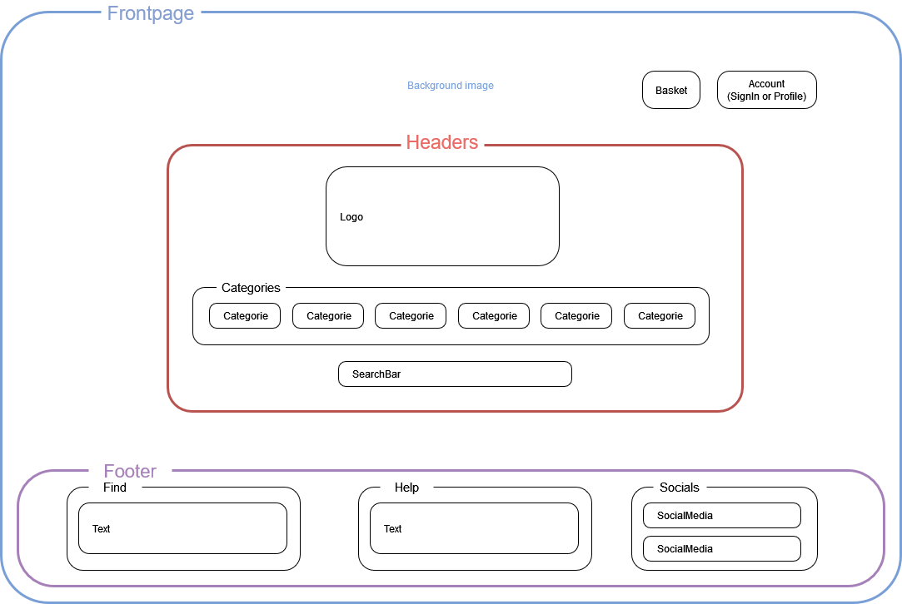
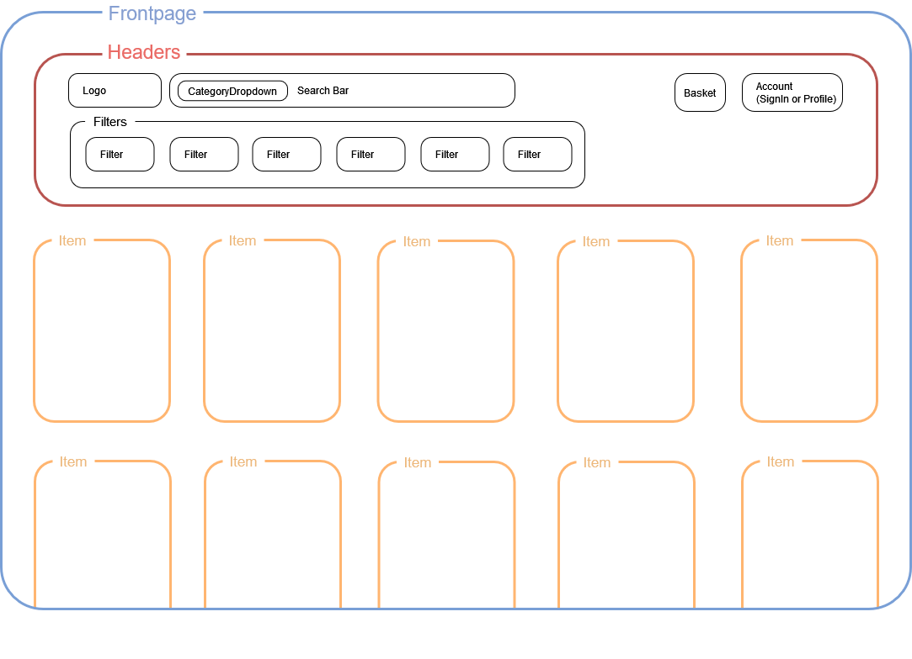
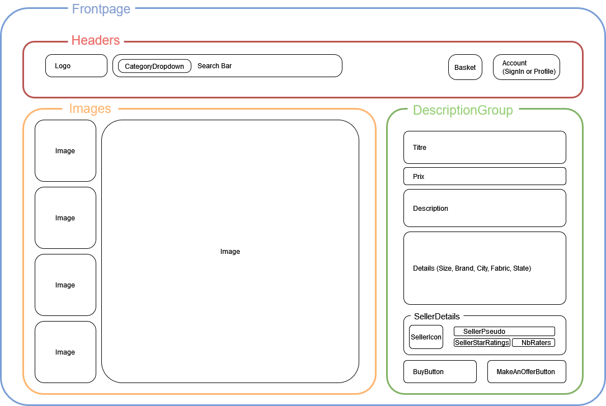
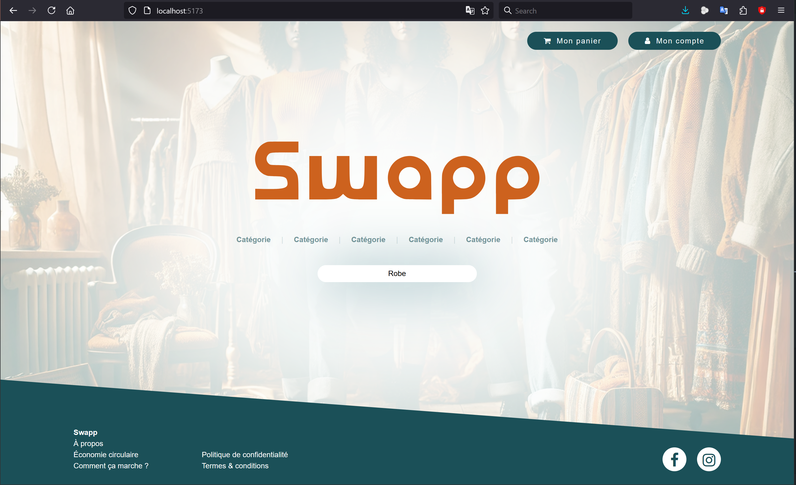
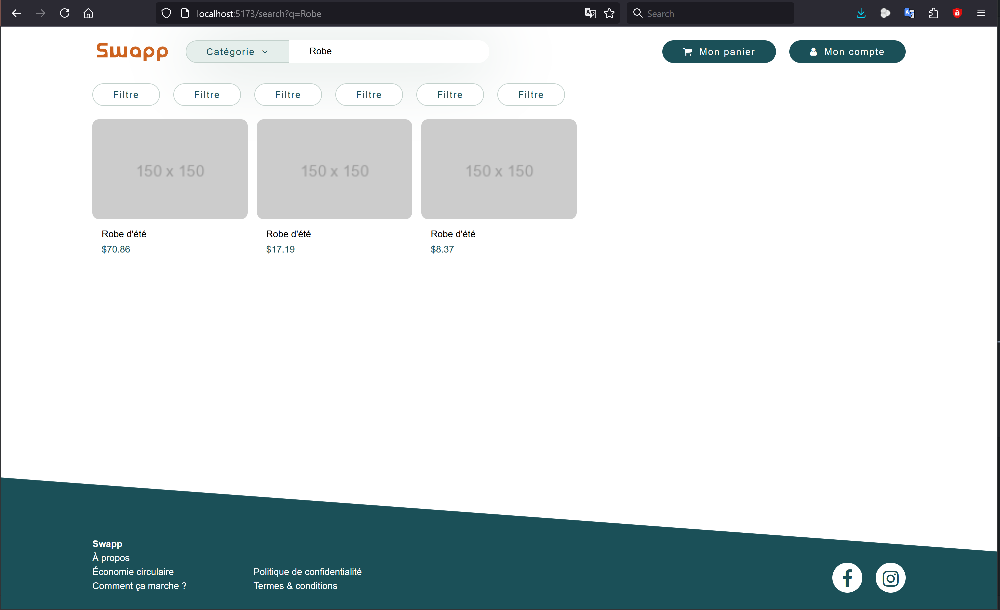

# Swapp
Plateforme de vente et d'achat de vêtements d'occasion entre particuliers.

## Choix du sujet
Dans notre quotidien, les plateformes d’achat et de revente d’articles de seconde main, comme Vinted, prennent une place importante. En tant qu'utilisatrices régulières de ces services pour acheter et revendre des vêtements et accessoires que nous n'utilisons plus, nous avons constaté qu’elles pouvaient avoir un impact environnemental conséquent malgré leur objectif de promouvoir la réutilisation. Cela est dû à la forte demande en infrastructure numérique et au nombre d'interactions qu'elles nécessitent. 

L'essor des plateformes de seconde main s'inscrit dans une dynamique plus large d'économie circulaire. 73 % des Français ont déclaré avoir acheté un produit d'occasion au cours des 12 derniers mois (source : [ENOV](https://enov.fr/blog/actus/marche-de-la-seconde-main-2023)). Ces services jouent un rôle crucial dans la lutte contre la surconsommation et la réduction des déchets, mais leur impact écologique lié à leur utilisation numérique mérite d’être examiné pour optimiser leurs bénéfices.

## Utilité sociale
Les services de vente et d'échange d'articles de seconde main jouent un rôle social essentiel en réduisant les déchets et en prolongeant la durée de vie des objets. En facilitant les échanges entre particuliers, ces plateformes luttent activement contre la culture du jetable et la surproduction, notamment dans des secteurs à fort impact environnemental comme la mode, où la fast fashion est régulièrement pointée du doigt. 

Elles offrent une alternative à la consommation de produits neufs, plus durable et accessible, tout en permettant aux utilisateurs de générer un revenu complémentaire en revendant des articles qu'ils n'utilisent plus. Ces services sont également un levier d’inclusion économique, permettant à un large public d'acquérir des biens de qualité à prix réduits. En favorisant la réutilisation et l'échange, ils soutiennent la transition vers une économie circulaire, où les ressources sont mieux exploitées. 

Enfin, ces plateformes renforcent les liens sociaux en créant des communautés d'utilisateurs partageant des centres d'intérêt communs, et en facilitant les échanges locaux, promouvant ainsi des pratiques de consommation plus collaboratives et solidaires.

## Effets de la numérisation
La numérisation de la vente et de l’échange d’articles de seconde main a permis de démocratiser l'accès à ce type de services et de créer des communautés massives d'acheteurs et de vendeurs. Avant l’ère numérique, la revente d'articles se limitait à des pratiques locales comme les vide-greniers, les marchés de seconde main, ou encore les associations caritatives. Ces échanges restaient limités par les contraintes géographiques et le faible nombre d'acheteurs potentiels. Avec l'essor des plateformes numériques, les transactions se font désormais à grande échelle, ouvrant des possibilités accrues de trouver des acheteurs ou des vendeurs, mais avec un coût écologique amplifié par le trafic en ligne.

Bien que ça n’ait pas été l’objectif, un effet rebond s’est installé : l'échange facilité de biens qualitatifs à coûts dérisoires incite les utilisateurs à consommer plus que jamais. Du côté des vendeurs, il est probable que l'argent obtenu par la vente ne soit pas épargné, mais réinjecté dans des achats, qu’ils soient d'occasion ou neufs, ce qui compromet l'idée d'une véritable économie circulaire. Cette démesure s’illustre sur Vinted par la création de comptes “pro” d’utilisateurs qui capitalisent sur ce commerce (source : [Le Parisien](https://www.leparisien.fr/etudiant/vie-etudiante/a-20-ans-ils-gagnent-tous-les-mois-plusieurs-milliers-deuros-grace-a-vinted-PRLCSUNQ45BNFFM5GM7HASBVRI.php)).

D’autre part, chaque interaction numérique, qu'il s'agisse de la consultation des annonces, de l'envoi de messages, ou de la gestion des paiements et expéditions, a un coût écologique. L'impact environnemental d'une annonce en ligne peut sembler négligeable au premier abord, mais lorsqu'on considère les millions d'utilisateurs actifs et les multiples images, descriptions et requêtes serveur générées, cela devient significatif. De plus, des mécanismes incitatifs (comme les notifications push et les algorithmes de recommandation) poussent les utilisateurs à passer plus de temps sur la plateforme, augmentant ainsi leur empreinte numérique.

Pour contrer l’effet rebond, Swapp s’efforcera de limiter la stimulation artificielle de l'achat impulsif par une conception éthique de l’interface et de l'expérience utilisateur. Nous viserons un modèle d'interactions responsable, évitant les notifications fréquentes et en réduisant l’encouragement à une consommation excessive, en privilégiant une approche minimaliste et durable.

Enfin, il est essentiel de rappeler que si les plateformes de seconde main ont révolutionné le marché de l'occasion en le rendant accessible, elles doivent aussi trouver un équilibre entre accessibilité et durabilité pour préserver leur impact écologique positif initial.

# Scénarios d'usage
Nous faisons l'hypothèse que les utilisateurs visitent les plateformes de vente d'articles de seconde main lors de moments opportunistes, que ce soit pendant leurs pauses, dans les transports en commun ou à la maison. Ces visites peuvent être motivées par la recherche d'articles spécifiques, la découverte de bonnes affaires ou la consultation de nouveautés.

## Scénario 1 : Consulter les articles de la page de recherche
Ce scénario répond à l’un des besoins primaires d’un utilisateur qui découvre la plateforme. La présentation d’articles récents ou populaires lui permet d’explorer le catalogue facilement. Cela attire les nouveaux visiteurs et augmente leur engagement initial sans demander un investissement immédiat (comme une inscription), facilitant la découverte de la plateforme.

#### Étapes :
1.  L’utilisateur visite le site pour la première fois.
2.  Il accepte les cookies.
3.  Il accède à la page de recherche, où sont affichés les articles les plus récents ou ceux mis en avant.
4.  Il scrolle jusqu’en bas pour voir plus d'articles.

## Scénario 2 : Rechercher des articles spécifiques et ajouter un article au panier
Ce scénario montre l’expérience utilisateur pour trouver un produit spécifique, ce qui est essentiel pour les acheteurs ayant un besoin ou une préférence particulière. Ajouter un article au panier sans procéder à l’achat final évite l'accumulation d'achats impulsifs, limitant ainsi l'impact écologique et encourageant une consommation réfléchie.

Remarque : L’absence d’un scénario allant jusqu’à l’achat s’explique par la volonté de limiter l’achat compulsif et de privilégier une expérience écoresponsable, en encourageant l’utilisateur à se poser des questions avant de finaliser sa commande.

#### Étapes :
1.  L’utilisateur clique sur la barre de recherche et entre le mot-clé “veste en cuir”.
2.  Il clique sur "Rechercher" et attend les résultats.
3.  Il applique un filtre de prix.
4.  Il entre 0 en prix minimum.
5.  Il entre 50 en prix maximum.
6.  Il parcourt la liste des résultats filtrés.
7.  Il clique sur une annonce pour voir les détails.
8.  Il clique sur "Ajouter au panier".

## Scénario 3 : Déposer une annonce
Ce scénario couvre l'autre côté du cercle d'économie circulaire : la revente. En intégrant le dépôt d'annonces, la plateforme complète son objectif de prolonger la durée de vie des produits. Bien qu’il puisse ne pas être le premier scénario pour un MVP, le dépôt d’annonces est essentiel pour assurer un flux d’articles constants et garantir l’attractivité de la plateforme pour les acheteurs.

#### Étapes :
1. L’utilisateur clique sur le bouton pour déposer une annonce
2. Il ajoute une photo.
3. Il ajoute une description.
4. Il écrit des détails (taille, …)
5. Il poste  l’annonce.

## Scénario 4 : Consulter son panier et finaliser un achat (acte d'achat)
Ce scénario est crucial pour permettre aux utilisateurs de finaliser leur expérience d'achat en toute sécurité et avec transparence. En permettant une révision des articles ajoutés avant de passer commande, la plateforme encourage une consommation raisonnée. Pour un MVP, intégrer l’acte d'achat valide l’ensemble du processus de bout en bout, assurant ainsi la complétude du cycle d'achat/revente.

 #### Étapes :
1. L’utilisateur accède à son panier pour revoir les articles qu’il a sélectionnés.
2. Il vérifie les détails des articles, les conditions de vente, et les frais d’expédition.
3. Il choisit une méthode de paiement.
4. Il valide le paiement et finalise son achat.

# Maquettage & données
Afin de limiter au maximum l'afflux de données inutile, nous avons choisi de mettre en place une page d'accueil sans scroll, dans laquelle il est possible de sélectionner une catégorie ou taper un élément spécifique dans le champ de saisie. 

Fig1 : maquette de la page d'accueil

Cette même idée est poursuivie dans la page de recherche. Les items sont donc à minima triés par catégorie, afin de limiter les données à récupérer. Il est possible de pousser la recherche en lançant une recherche par mot clef ou en précisant un état, une taille, une couleur, un prix, sa localisation.

Fig2 : maquette de la page de recherche

Le nombre d'images admis par item est de 4, à la taille maximale de 1Mo.

Fig3 : maquette de la page descriptive d'un élément

L'échantillon de données a été créé par dummy-json selon les attributs de catégorie, état, taille, couleur, prix et localisation évoqués préalablement.

# Prototypes

## Prototype 1
Pour ce premier prototype, nous mettons en place les scripts nécessaires au déroulé du scénario 1. Nous créons et mettons à jour dynamiquement en React une grille de résultats en fonction d'un mot clef, à partir de données statiques stockées dans sample_data.json. Seule la barre de recherche est pour l'instant fonctionnelle.

Fig4 : Prototype 1 - Screenshot de la page d'accueil

Fig5 : Prototype 1 - Screenshot de la page de recherche

Le nombre d'éléments à récupérer par recherche n'est pas encore établi, mais le sera au prototype suivant. Il ne sera alors possible que d'afficher 20 éléments à la fois.

## Prototype 2 

# GreenFrame

## Swapp Benchmark

Nous avons fait le test sur 5 pages :
- https://www.vinted.fr/
- https://www.depop.com/fr/
- https://www.leboncoin.fr/
- https://www.etsy.com/fr
- https://www.geev.com/fr/recherche/objets?location=48.862725%2C2.287592&type=donation&distance=15000

Sur ces 5 pages, seules 2 ont fonctionné correctement : Vinted et Geev. Deepop a "Scenario failed" et Leboncoin et Etsy sont bloqués sur des pages de Captcha.

Voici le résultat pour Vinted : [Résultat GreenFrame Vinted](https://app.greenframe.io/analyses/547cd8a6-e40c-4a03-b636-f107d62ddc51)

Voici le résulat pour Geev : [Résultat GreenFrame Geev](https://app.greenframe.io/analyses/9aab1aad-f384-4412-93f9-d540625cb52d)

## Swapp

### 1er résultat

Voici le premier résultat obtenir sur notre application pour 2 scénarios : 
- Scenario 1: Consulter la page d'accueil
- Scenario 2: Consulter la page d'articles
[1er Résultat GreenFrame Swapp](https://app.greenframe.io/analyses/e49632a6-7d22-4fad-8da5-18c6048cd532)

Nous remarquons que le retour n'est pas très fameux : 80mg pour les deux scénarios dont :
- 48 mg pour le scénario 1
- 32 mg pour le scénario 2
  
Donc on peut largement améliorer le scénario 1. Nous avons identifié que le problème principale était la background image de notre page d'accueil que nous avons supprimé pour améliorer le résultat.

### 2ème résultat

Pour les mêmes scénario, voici le résultat :
[2eme Résultat GreenFrame Swapp](https://app.greenframe.io/analyses/b8d3ddbf-e5d7-4fcd-b874-3183741a2be6)

Nous remarquons que le retour meilleur : 63mg pour les deux scénarios dont :
- 31 mg pour le scénario 1
- 32 mg pour le scénario 2

Supprimer la background image a largement améliorer notre impact.

### 3ème résultat

Ajout d'une background image pour l'effet esthétique et compréhension du service. Cependant, cette background image a un impact bien moindre comparé à celle initiale.

# Prototype 3 : Données dynamiques & Chargement dynamique

Dans cette troisième version du prototype, les données sont désormais centralisées dans une base de données CouchDB, accessible via une API Web. L’adoption d’une telle solution offre plusieurs avantages : elle permet d’ajouter, de modifier et de gérer les articles de manière plus fluide, tout en offrant une plus grande flexibilité pour le filtrage et l’accès aux données.

Pourquoi choisir une base de données plutôt qu’un fichier statique ?
→ Exécution de requêtes dynamiques et complexes pour un accès plus précis aux données
→ Meilleure gestion de l’espace de stockage et des performances à grande échelle
→ Modification et mise à jour des données facilitées, sans avoir à manipuler manuellement un fichier volumineux

(ajouter images de comparaison)

=> pas de changement conséquent sur le réseau mais CPU qui augmente (normal car création d'un backend)

De ces différentes mesures, nous pouvons retenir que l'effet de l'introduction d'une base de données, quoique négligeable, est, pour l'instant, plutôt défavorable d'un point de vue écologique. Le bilan de ce changement devrait cependant rapidement s'inverser avec l'augmentation de la quantité de données gérées et les requêtes réalisées.

# Prototype 4

## Passage à l'échelle

Dans le cadre de notre service, la croissance des données est principalement liée à deux aspects : le volume des annonces et les médias associés (photos). L'évolution de ces données est directement liée à la croissance du nombre d'utilisateurs et au rythme de publication des annonces.

Facteurs d'augmentation des données :
1. **Nombre d'utilisateurs**

Chaque nouvel utilisateur inscrit est susceptible de :
- Ajouter des annonces (texte, photos, descriptions).
- Effectuer des interactions (messages, transactions, évaluations, etc.).
  
L'augmentation est non linéaire puisque le nombre de nouveaux utilisateurs peut croître rapidement grâce au bouche-à-oreille et aux campagnes de marketing.
2. **Volume d'annonces**
- Chaque utilisateur peut publier plusieurs annonces.
- Les annonces restent dans la base de données (même après la vente ou l'expiration) pour des raisons de traçabilité et d'historique.
- La croissance est approximativement linéaire en fonction du nombre d'utilisateurs et de leur activité.
3. **Médias associés (photos)**
- Chaque annonce inclut plusieurs photos (généralement 3 à 5).
- Ces fichiers multimédias représentent la majeure partie de l'empreinte en stockage.

## Evolution de l'impact

La figure suivante illustre l'évolution de l'impact environnemental lors du passage à l'échelle, avec une augmentation significative du nombre d'articles publiés, passant de 15 à 3000 (correspondant à une période étendue de publication). On constate une hausse de 140 % de l'impact lié à l'utilisation du processeur (CPU) au niveau du backend, traduisant une charge accrue pour le traitement et le rendu des contenus. En parallèle, l'impact du réseau au niveau du backend connaît une augmentation encore plus marquée, avec une croissance de 231 %, soulignant les besoins accrus en bande passante pour gérer le trafic et la diffusion des articles à grande échelle. Ces évolutions mettent en lumière les défis environnementaux liés à l'augmentation de la volumétrie dans un contexte numérique backend-centric.

(mettre screenshot)

L'évolution ne concerne bien sûr que la page de recherche des vestes en cuir. Dans tous les cas, nous obligeons l'utilisateur à faire une recherche afin de ne jamais afficher tous les articles. 
